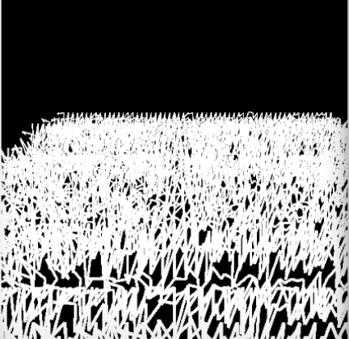

# zmei6507_9103_TUT4_Project
# 9103 MajorProject

## Zizi Mei (Random Seed or Perlin Noise)
**I will use perlin noise to animate my project.**

**I was inspired by a video that illustrated an artistic concept of mixing paint with water. This led me to think further about Monet's painting technique for depicting the water in 'Saint Georges majeur au crépuscule', that is, to draw the flow of the Grand Canal through lines and brush strokes. Through the perlin noise, I will follow the flow implied by the brush strokes in the original artwork and try to simulate the horizontal undulations and the waves of the Grand Canal in Venice.**

[Link of WaterArt Video](https://www.bilibili.com/video/BV1nW411v7v7/?spm_id_from=333.337.search-card.all.click&vd_source=fc9c0f64a454bdacf3b6840edc7786c3)

## Code References

**Perlin noise determines the components that symbolize the fluctuation of the water surface of the Grand Canal in my project. The value of noise, as an important parameter, will be adjusted by me to the most appropriate state, to pay tribute to the peaceful and mysterious atmosphere of Monet's original artwork.**

[Link of Youtube Tutorial](https://www.youtube.com/watch?v=_Tyhfpxwips)

[Link of Toolkit](https://github.com/vharivinay/Flow-field-using-noise)

[Link of Coding](https://editor.p5js.org/codingtrain/sketches/vDcIAbfg7)

[Link of Generating Flow Fields with Perlin Noise](https://vharivinay.xyz/generative/flowfiled/)

